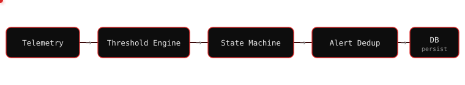
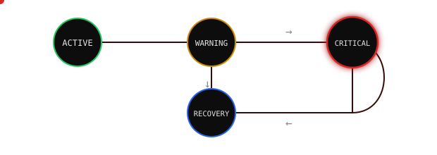

<div align="center">


<br>


<br><br>

<a href="https://nikhcodes.github.io"></a>
<a href="mailto:nikhiel.lingard.dev@gmail.com"></a>
<a href="https://www.linkedin.com/in/nikhiel-lingard/"></a>
<a href="https://github.com/NikhCodes"></a>


</div>


## about

> I work as an **IT Operator at a fintech bank** in Suriname by day and study
> software engineering at **UNASAT** the rest of the time.
>
> The two feed each other more than I expected. Watching how a production
> banking environment actually breaks, gets monitored, and gets patched
> has shaped what I want to build more than any course has.
>
> I started in full-stack because it let me ship things quickly. I'm moving
> toward **backend engineering**, with most of my time going into
> **Java, Spring Boot, and PostgreSQL**. Somewhere along the way I became
> more interested in what happens when the request lands than in what the
> button looks like.
>
> **Authentication flows, state machines, failure modes, and the
> infrastructure between an application and the outside world** are the
> parts I keep coming back to.
>
> I don't collect frameworks.
>
> I'd rather spend three months understanding **Spring Security's filter
> chain** than skim ten tutorials on ten different stacks.

<br>

<table width="100%">
<tr>
<td width="33%" valign="top" align="center">


<br><br>
IT Operator, fintech banking
<br>
<sub>incident response · monitoring · systems that can't just go down</sub>

</td>
<td width="33%" valign="top" align="center">


<br><br>
BSc IT / Software Engineering
<br>
<sub>UNASAT</sub>

</td>
<td width="33%" valign="top" align="center">


<br><br>
Backend engineering
<br>
<sub>Java · Spring Boot · PostgreSQL</sub>

</td>
</tr>
</table>


## currently

<div align="center">

</div>

<sub>● production &nbsp;&nbsp; ● learning &nbsp;&nbsp; → next</sub>

<details>
<summary><sub>plain text version</sub></summary>

```yaml
role:      IT Operator, fintech banking — production systems, incident response
studying:  BSc IT / Software Engineering, UNASAT
building:  Java, Spring Boot, PostgreSQL, Spring Security
reading:   OWASP Top 10, authentication design, caching strategies
next up:   Docker, Nginx, deployment infra
```

</details>


## stack

<table width="100%">
<tr>
<td valign="top" width="20%"><b>backend</b><br><br></td>
<td valign="top" width="20%"><b>data</b><br><br></td>
<td valign="top" width="20%"><b>frontend</b><br><br></td>
<td valign="top" width="20%"><b>infra</b><br><br></td>
<td valign="top" width="20%"><b>security</b><br><br>
<br>
<br>

</td>
</tr>
</table>


## projects

Each of these started because I wanted to understand one specific thing properly, not because I needed portfolio filler.

<br>

<table width="100%">
<tr><td>


### [RigSight](https://github.com/NikhCodes/rigsight)
**simulated industrial monitoring platform**

I wanted to know what a backend looks like when it isn't just answering CRUD requests, but reacting to continuous data: thresholds, state transitions, and repeated alerts that need deduplicating instead of spamming.

<div align="center">



<br>



</div>

<br>

JWT-secured, role-based access, Flyway-managed schema, Dockerized PostgreSQL.

`Java 21` `Spring Boot` `Spring Security` `JWT` `Hibernate` `PostgreSQL` `Flyway` `Docker`

</td></tr>
</table>

<br>

### AGAS
**academic group accountability system**

Built for a university module, but I used it to go deeper on backend security than the assignment required: bcrypt hashing, a three-role authorization model, and an append-only audit log using JSONB metadata so nothing gets silently overwritten.

UUID primary keys and soft deletes throughout. Small decisions, but the kind that matter once real data is involved.

`Node.js` `Express` `PostgreSQL` `JWT` `bcrypt` `Helmet` `Joi`

<br>

### [NikhOS](https://github.com/NikhCodes/NikhOS)
**student workspace, built as a PWA**

A grade and assignment tracker that I actually use, built to feel native rather than like a website. It's installable, works offline, and doesn't make you wait through loading screens for basic navigation.

live → https://nikh-os-red.vercel.app

`React` `Vite` `Tailwind CSS` `Framer Motion`

<br>

### [Pose Cam](https://github.com/NikhCodes/face-tracker)
**real-time hand gesture detection**

No trained models here. Gesture classification is done entirely through landmark geometry with MediaPipe.

I wanted to understand computer vision as math and geometry before reaching for anything pretrained.

`Python` `MediaPipe` `OpenCV` `NumPy`


## github

<div align="center">


<br>


<br><br>


<br><br>

<picture>
  <source media="(prefers-color-scheme: dark)" srcset="https://github.com/NikhCodes/NikhCodes/blob/output/github-contribution-grid-snake-dark.svg">
  
</picture>

</div>


<div align="center">

<sub>trying to understand systems before optimizing them</sub>

<br><br>


</div>
